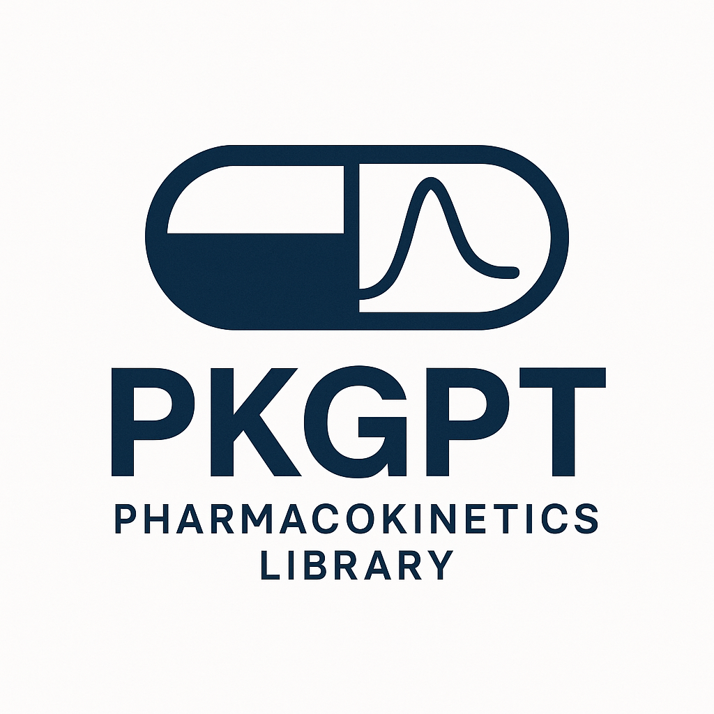

<p align="center">
  
</p>

# PKGPT - Pharmacokinetic NONMEM Optimizer

Recursive optimization of NONMEM control stream files using Google Gemini AI.

## Overview

PKGPT automatically generates and iteratively improves NONMEM population pharmacokinetic models using advanced AI. The system:

1. **Analyzes** your pharmacokinetic dataset structure
2. **Generates** an initial NONMEM control stream
3. **Executes** NONMEM and parses results
4. **Improves** the model recursively (3-10 iterations)
5. **Saves** the best performing model

## Features

- **Automated Model Generation**: Creates complete NONMEM control streams from data
- **Automatic Compartment Detection**: Analyzes concentration-time profiles to intelligently select model structure
  - NCA-based terminal phase λz estimation (log-linear regression)
  - Early distribution phase slope analysis after Cmax
  - BIC-based comparison of 1-compartment vs 2-compartment models
  - Conservative algorithm: Only suggests 2-compartment when strong biphasic pattern detected (slope ratio ≥ 3.0, R² ≥ 0.98)
  - Prevents overfitting by defaulting to simpler 1-compartment model in ambiguous cases
- **Recursive Optimization**: Iteratively improves models based on NONMEM output
- **Multi-Model Support**: Uses multiple Gemini models (Flash, Flash-Lite, Pro)
- **Smart Analysis**: Detects NONMEM columns, covariates, and data structure
- **AI-Powered Parsing**: Uses Gemini to intelligently parse NONMEM output with automatic regex fallback
  - Context-aware extraction of OFV, parameters, warnings, and errors
  - Accurate RSE% and Shrinkage% calculation
  - Distinguishes between real errors and code comments
  - More robust than traditional regex patterns
- **Progress Tracking**: Clear iteration history and improvement metrics

## Requirements

- Python 3.8+
- NONMEM 7.x (for actual execution)
- Google Gemini API key

## Installation

1. Clone or download this repository

2. Install dependencies:
```bash
pip install -r requirements.txt
```

3. Set up your API key:
```bash
# Copy the example file
cp .env.example .env

# Edit .env and add your API key
# GEMINI_API_KEY=your_api_key_here
```

Get your API key from: https://aistudio.google.com/app/apikey

## Usage

### Basic Usage

```bash
python pkgpt_optimizer.py <data_file> <output_base>
```

### Examples

```bash
# Basic usage (uses flash model by default)
python pkgpt_optimizer.py dataset/theophylline_nonmem.csv output_theo

# Use specific Gemini model
python pkgpt_optimizer.py dataset/theophylline_nonmem.csv output_theo --model pro

# Optimize warfarin with custom iterations and model
python pkgpt_optimizer.py dataset/warfarin_nonmem.csv output_warf --min-iter 5 --max-iter 15 --model flash-lite

# Use custom NONMEM command
python pkgpt_optimizer.py dataset/pheno_sd.csv output_pheno --nmfe nmfe74
```

### Command Line Options

```
positional arguments:
  data_file             Path to input CSV dataset (NONMEM format)
  output_base           Base name for output files (without extension)

optional arguments:
  --min-iter N          Minimum number of iterations (default: 3)
  --max-iter N          Maximum number of iterations (default: 10)
  --nmfe CMD            NONMEM execution command (default: nmfe75)
  --model MODEL         Gemini model: flash (default), flash-lite, or pro
  --api-key KEY         Google Gemini API key (overrides env var)
  --version             Show version information
  -h, --help            Show help message
```

## Output Files

The optimizer generates several files:

- `<output>_iter0.txt` - Initial NONMEM control stream
- `<output>_iter1.txt` - First iteration model
- `<output>_iter1.lst` - NONMEM output for iteration 1
- `<output>_iter2.txt` - Second iteration model
- `<output>_iter2.lst` - NONMEM output for iteration 2
- ... (continues for all iterations)
- `<output>_final.txt` - **Best model** (copy of best iteration)

## Dataset Format

Your CSV dataset should follow NONMEM conventions:

### Required Columns
- `ID` - Subject identifier
- `TIME` - Time point
- `DV` - Dependent variable (concentration/observation)
- `AMT` - Dose amount
- `EVID` - Event ID (1=dose, 0=observation)
- `MDV` - Missing DV flag (1=missing, 0=observed)

### Optional Columns
- `CMT` - Compartment number
- `RATE` - Infusion rate
- Covariates: `WT`, `AGE`, `SEX`, `CRCL`, etc.

### Example Dataset Structure

```csv
ID,TIME,AMT,RATE,EVID,CMT,DVID,DV,MDV,WT,SEX
1,0.0,4.02,0,1,1,1,,1,79.6,M
1,0.25,0.0,0,0,1,1,2.84,0,79.6,M
1,0.57,0.0,0,0,1,1,6.57,0,79.6,M
...
```

## How It Works

### 1. Data Analysis
The system analyzes your dataset to understand:
- Column structure and types
- NONMEM standard columns
- Subject-level covariates
- Data dimensions and statistics
- **Pharmacokinetic profile characteristics**:
  - Terminal elimination rate constant (λz) via log-linear regression on tail concentrations
  - Early distribution phase slope (λearly) after Cmax
  - Mono-exponential vs biphasic decay pattern detection
  - **Automatic compartment model recommendation** (1-comp vs 2-comp) based on:
    - BIC comparison (Bayesian Information Criterion)
    - Slope ratio (λearly/λz) and goodness-of-fit (R²)
    - Conservative threshold: 2-compartment only if ΔBIC > 20 AND slope ratio ≥ 3.0 AND R² ≥ 0.98

### 2. Initial Model Generation
Using Google Gemini Pro with data-driven insights, generates:
- Complete NONMEM control stream
- **Appropriate structural model** based on automatic compartment detection
  - Data-informed selection between 1-compartment (ADVAN2) and 2-compartment (ADVAN4) models
  - Prevents unnecessary complexity in model structure
- Initial parameter estimates
- Covariate relationships

### 3. Recursive Optimization
For each iteration:
1. Execute NONMEM
2. **AI-Parse output** (.lst file) with automatic fallback
   - Gemini extracts OFV, parameters, RSE%, Shrinkage%
   - Context-aware error detection
   - Falls back to regex if AI parsing fails
3. Identify issues and warnings
4. Generate improved model considering:
   - Objective Function Value (lower is better)
   - RSE% (< 30% for THETA, < 50% for OMEGA)
   - ETA Shrinkage (< 30% is good)
5. Repeat until convergence or max iterations

### 4. Convergence Criteria
Stops when:
- Successful minimization with no major warnings
- OFV change < 0.1 from previous iteration
- All parameters within bounds
- Minimum iterations completed

## Available Gemini Models

You can choose from three Gemini models using the `--model` parameter:

- **flash** (default) - `gemini-flash-latest`
  - Fast, balanced performance
  - Good for most use cases
  - Recommended for routine optimization

- **flash-lite** - `gemini-flash-lite-latest`
  - Lightweight and fast
  - Lower cost per request
  - Good for quick iterations and testing

- **pro** - `gemini-2.5-pro`
  - Most capable model
  - Best for complex datasets
  - Higher quality analysis

**Example:**
```bash
# Use pro model for complex analysis
python pkgpt_optimizer.py data.csv output --model pro

# Use flash-lite for quick testing
python pkgpt_optimizer.py data.csv output --model flash-lite --max-iter 3
```

## Testing Without NONMEM

The system works even without NONMEM installed:
- Generates NONMEM control streams
- Creates mock output files
- Demonstrates recursive improvement process

This allows you to:
- Test the system on any machine
- Review generated NONMEM code
- Transfer files to NONMEM-enabled system for actual execution

## Example Session

```bash
$ python pkgpt_optimizer.py dataset/theophylline_nonmem.csv test_output

======================================================================
NONMEM RECURSIVE OPTIMIZER
======================================================================
✓ Initialized Gemini client with model: gemini-2.5-pro
✓ Loaded dataset: dataset/theophylline_nonmem.csv
  Shape: 132 rows × 11 columns

======================================================================
DATASET SUMMARY
======================================================================
Dataset: theophylline_nonmem.csv
Total rows: 132
Total columns: 11

Detected NONMEM columns:
  - ID (ID): 132 observations
  - TIME (TIME): 132 observations
  - AMT (AMT): 132 observations
  - DV (DV): 120 observations
  ...

======================================================================
STARTING OPTIMIZATION
======================================================================
Min iterations: 3
Max iterations: 10
Output base: test_output

Generating initial NONMEM control stream...
✓ Initial code generated and saved to: test_output_iter0.txt

======================================================================
ITERATION 1/10
======================================================================
Executing NONMEM: nmfe75 test_output_iter1.txt test_output_iter1.lst
✓ NONMEM execution completed
...

✓ Optimization completed successfully!
✓ Best model saved to: test_output_final.txt
```

## Troubleshooting

### API Key Issues
```
Error: GEMINI_API_KEY environment variable not set
```
**Solution**: Create `.env` file with your API key or export it:
```bash
export GEMINI_API_KEY='your-api-key-here'
```

### NONMEM Not Found
```
⚠ NONMEM command 'nmfe75' not found
```
**Solution**:
- Install NONMEM, or
- System will create mock outputs for testing
- Transfer generated `.txt` files to NONMEM system

### Dataset Format Issues
**Solution**: Ensure your CSV has:
- Header row with column names
- Standard NONMEM columns (ID, TIME, AMT, DV, EVID, MDV)
- Numeric values for PK data

## Advanced Usage

### Custom Prompts
Edit `modules/prompt_templates.py` to customize:
- Model generation strategy
- Improvement criteria
- Convergence assessment

### Custom Parsers
Extend `modules/nonmem_parser.py` to extract:
- Additional statistics
- Custom warnings
- Model diagnostics

## Contributing

This is a research tool. Suggestions and improvements welcome!

## License

MIT License - See LICENSE file for details

## Authors

**Hyunseung Kong¹*** and **Hoyoung Kwack²*** (Co-first authors, contributed equally)

¹ Seoul National University (hskong@snu.ac.kr)
² Yonsei University (hoyoung0104@yonsei.ac.kr)

\* These authors contributed equally to this work.

## Citation

If you use PKGPT in your research, please cite:
```
PKGPT - Pharmacokinetic NONMEM Optimizer using Google Gemini AI
Authors: Hyunseung Kong* and Hoyoung Kwack* (*equal contribution)
Seoul National University & Yonsei University
Contact: hskong@snu.ac.kr, hoyoung0104@yonsei.ac.kr
```

## Disclaimer

This tool generates NONMEM code using AI. Always review and validate generated models before using in production or regulatory submissions. The quality of results depends on:
- Dataset quality and structure
- API model capabilities
- NONMEM installation and configuration

## Support

For issues, questions, or suggestions:
- Open an issue on GitHub
- Check the examples/ directory for reference files
- Review generated code for debugging

---

**Happy Modeling! 💊📊🤖**
